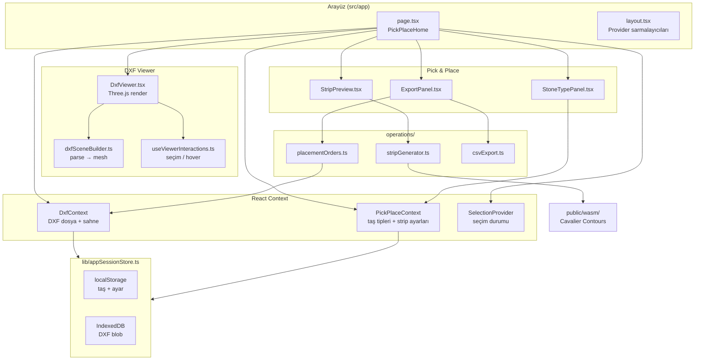

# IO-CAM Pick & Place

DXF tabanlı taş (veya benzeri parça) yerleştirme planı hazırlayan web uygulaması. Kullanıcı bir desen dosyası yükler, kontürlere taş tipleri atar, strip (alma şeridi) düzenini önizler ve kumaş üzerindeki hedef konumları **CSV** olarak dışa aktarır.

CSV çıktısı Python **runtime** backend'e gönderilerek vision-guided pick & place çalıştırılır (`/production` sekmesi).

---

## İçindekiler

- [Ne yapar?](#ne-yapar)
- [Mimari özeti](#mimari-özeti)
- [Kullanıcı akışı](#kullanıcı-akışı)
- [CSV çıktı formatı](#csv-çıktı-formatı)
- [Proje yapısı](#proje-yapısı)
- [Durum yönetimi (Context)](#durum-yönetimi-context)
- [DXF görüntüleyici](#dxf-görüntüleyici)
- [Pick & Place modülleri](#pick--place-modülleri)
- [Oturum kalıcılığı](#oturum-kalıcılığı)
- [WASM (Cavalier Contours)](#wasm-cavalier-contours)
- [Kurulum ve çalıştırma](#kurulum-ve-çalıştırma)
- [Geliştirme notları](#geliştirme-notları)

---

## Ne yapar?

| Adım | Açıklama |
|------|----------|
| 1 | `.dxf` (veya `.dwg` → DXF dönüşümü) dosyası yüklenir |
| 2 | Three.js sahnesinde kontürler görüntülenir ve seçilir |
| 3 | Taş tipleri tanımlanır; seçili kontürler tipe atanır |
| 4 | Strip şablonu üretilir (pick ızgarası + offset kontürler) |
| 5 | Her atanan kontür için kumaş hedefi (X, Y, açı) hesaplanır |
| 6 | Sonuç `placement_*.csv` olarak indirilir |

---

## Mimari özeti

Uygulama tek sayfalık bir **Next.js 15** istemcisidir. Ağır geometri işleri tarayıcıda (Three.js + WASM) yapılır; sunucu tarafında özel bir API route’u yoktur.



---

## Kullanıcı akışı

Ana ekran `src/app/page.tsx` içindeki `PickPlaceHome` bileşenidir:

- **Sol panel:** DXF yükleyici veya `DxfViewer` (tam ekran 3D/2D canvas)
- **Sağ panel:** Taş tipleri → Strip şablonu → CSV dışa aktarma

```text
┌─────────────────────────────────────┬──────────────────┐
│  DXF Viewer (Three.js)              │  Taş Tipleri     │
│  - dosya yükle / oturum geri yükle  │  StoneTypePanel  │
│  - kontür seçimi                    ├──────────────────┤
│  - taş rengine göre boyama          │  Şablon          │
│                                     │  StripPreview    │
│                                     ├──────────────────┤
│                                     │  Dışa aktar      │
│                                     │  ExportPanel     │
└─────────────────────────────────────┴──────────────────┘
```

Provider sırası `src/app/layout.tsx` içinde tanımlıdır:

```tsx
<SelectionProvider>
  <DxfProvider>
    <PickPlaceProvider>
      {children}
    </PickPlaceProvider>
  </DxfProvider>
</SelectionProvider>
```

---

## CSV çıktı formatı

Üretim `src/operations/csvExport.ts` ve veri kaynağı `src/operations/placementOrders.ts` üzerinden yapılır.

**Başlık satırı:**

```csv
id,target_x,target_y,target_angle,shape_id
```

| Sütun | Kaynak | Açıklama |
|-------|--------|----------|
| `id` | `PlacementOrder.index` | Sıra numarası (0’dan başlar; taş tipi sırası + kontür sırası) |
| `target_x` | `placeX` | Kumaş/DXF düzleminde hedef X (mm) |
| `target_y` | `placeY` | Hedef Y (mm) |
| `target_angle` | `placeAngle` | Yerleştirme açısı (°), `contourAngle.ts` ile hesaplanır |
| `shape_id` | `shapeId` (= DXF entity `handle`) | Kontürün benzersiz kimliği |

`placeX` / `placeY` hesabı: kontürün merkezi (`data.center`) veya poligon köşe ortalaması.  
`placeAngle`: convex hull + minimum bounding rectangle (`src/Utils/contourAngle.ts`).

`pickX` / `pickY` strip ızgarasında hesaplanır (`placementOrders.ts`) ancak CSV’ye yazılmaz; yalnızca strip önizlemesi ve ileride genişletme için `PlacementOrder` tipinde tutulur.

Örnek:

```csv
id,target_x,target_y,target_angle,shape_id
0,125.5,80.2,45.0,1A2B
1,130.1,82.0,0.0,1A2C
```

UI: `src/components/pick-place/ExportPanel.tsx` — **Önizle** ve **CSV indir**.

---

## Proje yapısı

```text
IORhine-1/
├── public/
│   └── wasm/                    # Cavalier Contours WASM (offset)
│       └── v0aigcode_cavalier_ffi.*
├── src/
│   ├── app/
│   │   ├── layout.tsx           # Root layout, provider’lar, metadata
│   │   ├── page.tsx             # Ana Pick & Place ekranı
│   │   └── globals.css
│   ├── components/
│   │   ├── dxf-viewer/          # Three.js DXF/3D viewer
│   │   │   ├── DxfViewer.tsx
│   │   │   ├── dxfSceneBuilder.ts
│   │   │   ├── useSelection.tsx
│   │   │   ├── useViewerInteractions.ts
│   │   │   └── dwgToDxfConverter.ts
│   │   ├── pick-place/
│   │   │   ├── StoneTypePanel.tsx
│   │   │   ├── StripPreview.tsx
│   │   │   └── ExportPanel.tsx
│   │   └── ui/                  # shadcn/Radix bileşenleri
│   ├── contexts/
│   │   ├── DxfContext.tsx
│   │   └── PickPlaceContext.tsx
│   ├── operations/
│   │   ├── stripGenerator.ts    # Strip hücreleri + DXF export
│   │   ├── placementOrders.ts   # Yerleştirme satırları
│   │   └── csvExport.ts
│   ├── types/
│   │   └── pickplace.ts         # StoneType, PickPlaceConfig, PlacementOrder
│   ├── lib/
│   │   └── appSessionStore.ts   # localStorage + IndexedDB
│   └── Utils/
│       ├── contourAngle.ts
│       ├── offsetUtils.ts       # WASM offset sarmalayıcı
│       └── dxfWriter.ts
├── package.json
├── docker-compose.yml
└── Dockerfile
```

---

## Durum yönetimi (Context)

### `DxfContext` — `src/contexts/DxfContext.tsx`

| Alan | Rol |
|------|-----|
| `selectedDxfFile` | Yüklü `File` nesnesi |
| `parsedDxf` | `dxf-parser` çıktısı |
| `mainGroup` | Three.js `Group` (tüm çizim) |
| `dxfScene` | Three.js `Scene` referansı |
| `modelTransform` | 3D model konum/dönüş (3D yüklemede) |
| `dxfSessionHydrated` | IndexedDB’den DXF geri yükleme bitti mi |
| `clearDxfSession()` | Yalnızca çizimi kaldır |

Sayfa açılışında IndexedDB’den önceki DXF blob’u okunur (`loadDxfBlob`).

### `PickPlaceContext` — `src/contexts/PickPlaceContext.tsx`

| Alan | Rol |
|------|-----|
| `stoneTypes` | Taş tipi listesi (`StoneType[]`) |
| `activeStoneTypeId` | Viewer’da vurgulanan tip |
| `pickPlaceConfig` | Strip ızgara ayarları |

Varsayılan strip ayarları:

```ts
stripOriginX: -100, stripOriginY: -100,
cellSize: 10, rowLength: 2, cellGap: 0, contourOffset: 0.5
```

Taş tipi ve ayar değişiklikleri ~450 ms debounce ile `localStorage`’a yazılır.

### `SelectionProvider` — `src/components/dxf-viewer/useSelection.tsx`

Seçili Three.js objeleri (`Set<Object3D>`), handle ile geri yükleme ve pick-place modunda renk/opacity kuralları.

---

## DXF görüntüleyici

**Giriş:** `src/components/dxf-viewer/DxfViewer.tsx` (SSR kapalı; `dynamic(..., { ssr: false })`).

### Dosya yükleme

1. `.dxf` → `dxf-parser` ile parse  
2. `.dwg` → `dwgToDxfConverter.ts` (LibreDWG WASM) ile DXF string’e çevrilir  
3. 3D formatlar (GLTF, OBJ, …) ayrı yükleme yolunda işlenir

### Sahne oluşturma

`dxfSceneBuilder.ts`:

- Parse edilmiş entity’leri `Line2` / mesh olarak Three.js grubuna ekler  
- Her geometriye `userData.handle` (DXF handle) ve `userData.type` yazar  
- Bounding box ile kamerayı otomatik sığdırır

### Etkileşim

`useViewerInteractions.ts`:

- Tıklama / çoklu seçim  
- Pick-place modunda (`isPickPlaceMode`): atanan taş rengi, aktif tip vurgusu

Pick-place renk mantığı `DxfViewer.tsx` içinde `stoneTypes` ve `activeStoneTypeId` ile senkronize edilir.

---

## Pick & Place modülleri

### 1. Taş tipleri — `StoneTypePanel.tsx`

- Yeni tip: `id`, `name`, `color`, boş `contourIds[]`  
- DXF’te seçili objeler → **Ata** ile `contourIds` güncellenir  
- Sıra: `reorderStoneTypes` (pick/place CSV sırasını etkiler)

Tip tanımı: `src/types/pickplace.ts` → `StoneType`.

### 2. Strip şablonu — `StripPreview.tsx` + `stripGenerator.ts`

`generateStripData(scene, stoneTypes, config)`:

1. Her `contourId` için sahne objesinden vertex çıkarır  
2. Kontürü merkezler, `contourOffset` kadar **Cavalier offset** uygular  
3. `rowLength` × `cellSize` (+ `cellGap`) ızgarasında `pick` merkezi atar  

`exportStripToDxf(cells, config)` ile strip düzeni ayrı bir `.dxf` olarak indirilebilir (`dxfWriter.ts`).

### 3. CSV dışa aktarma — `ExportPanel.tsx`

```ts
const orders = buildPlacementOrders(dxfScene, stoneTypes, pickPlaceConfig);
const csv = placementOrdersToCsv(orders);
downloadPlacementCsv(csv);
```

`buildPlacementOrders` taş tiplerini sırayla dolaşır; her kontür için strip pick koordinatı ve kumaş place koordinatı üretir.

---

## Oturum kalıcılığı

`src/lib/appSessionStore.ts`:

| Depolama | İçerik |
|----------|--------|
| `localStorage` (`rhinecnc:v1:pickplace`) | `stoneTypes`, `pickPlaceConfig`, `activeStoneTypeId` |
| `localStorage` (`rhinecnc:v1:dxfMeta`) | `modelTransform` |
| `IndexedDB` (`rhinecnc-session`) | DXF ham metin blob |

`clearAppSession()` tümünü siler (ana sayfadaki **Yeni proje**).

---

## WASM (Cavalier Contours)

`src/app/page.tsx` mount’ta WASM yükler:

```ts
await initCavc('/wasm/v0aigcode_cavalier_ffi_bg.wasm');
```

Kullanım: `src/Utils/offsetUtils.ts` — strip kontürlerinde geçme payı (offset) için.  
Hazır olunca `window.__CAVALIER_WASM_READY__ = true` set edilir.

---

## Kurulum ve çalıştırma

### Gereksinimler

- Node.js 20+  
- npm  

### Tek komutla başlatma (önerilen)

Frontend + Python runtime birlikte kurulur ve açılır:

```bash
chmod +x scripts/start.sh   # ilk seferde
./scripts/start.sh
```

veya:

```bash
npm run start:all
```

Kamera/seri port olmadan denemek için:

```bash
npm run start:all:mock
```

Sadece bağımlılık kurulumu: `npm run install:all` veya `./scripts/start.sh --install`.

### Geliştirme (ayrı terminaller)

```bash
npm install
npm run dev
```

Uygulama varsayılan olarak **http://localhost:9002** adresinde açılır (`package.json` → `next dev -p 9002`).

Runtime ayrı terminalde:

```bash
cd io-cam-runtime && pip install -e ".[dev]" && uvicorn app.main:app --reload --port 8000
```

### Diğer komutlar

```bash
npm run build      # production build
npm run start      # production sunucu
npm run typecheck  # tsc --noEmit
npm run lint       # ESLint
```

### Docker

```bash
docker compose up --build
```

Port eşlemesi: host `9002` → container `3000` (`docker-compose.yml`).

---

## Geliştirme notları

### Koordinat sistemi

- DXF çizimleri X/Y düzleminde; viewer grid’i XZ’ye döndürülmüş (`GridHelper.rotateX(π/2)`).  
- CSV’deki `target_x` / `target_y` DXF entity verisinden gelir (kumaş koordinatı).

### Sıra (id) mantığı

`placementOrders.ts` içinde `stoneTypes` dizisi sırası, her tipin `contourIds` sırası korunur. Global `index` bu çift döngüde artar; CSV `id` alanı buna eşittir.

### Debug

`localStorage.DEBUG_DXF=1` veya `DEBUG_DXF_VIEWER=1` → viewer logları (`src/Utils/debug.ts`).

### Production (IO-CAM runtime)

Mimari: [IO-CAM-ARCHITECTURE.md](./IO-CAM-ARCHITECTURE.md). Durum: [PREPARATION.md](./PREPARATION.md).

- Frontend: `http://localhost:9002/production`
- Backend: `io-cam-runtime/` — `IO_CAM_MOCK_HARDWARE=1 uvicorn app.main:app --port 8000`

---

## Teknoloji özeti

| Katman | Teknoloji |
|--------|-----------|
| Framework | Next.js 15, React 18, TypeScript |
| UI | Tailwind CSS, Radix UI (shadcn) |
| 3D | Three.js, `dxf-parser`, Line2 |
| Geometri | Cavalier Contours WASM, Clipper (offsetUtils) |
| Kalıcılık | localStorage, IndexedDB |
| Paket adı | `nextn` (`package.json`) |

---

## Lisans

Bu depo özel projedir; kök dizinde ayrı bir lisans dosyası yoksa kullanım koşulları depo sahibiyle netleştirilmelidir.
